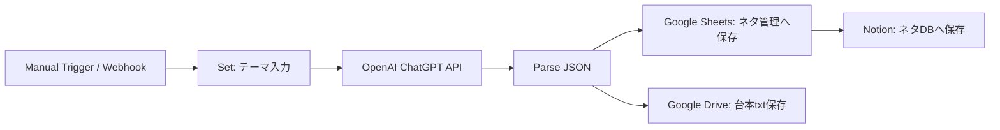
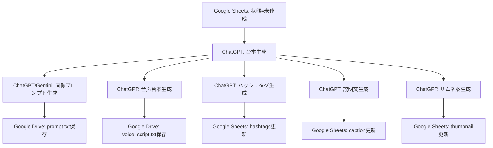
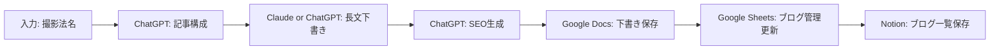
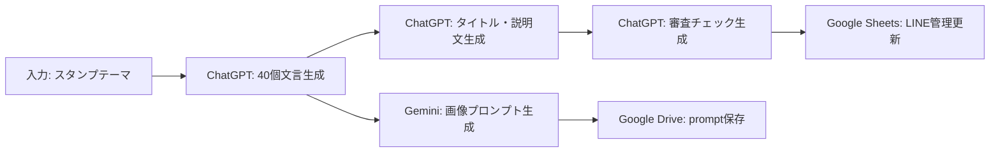
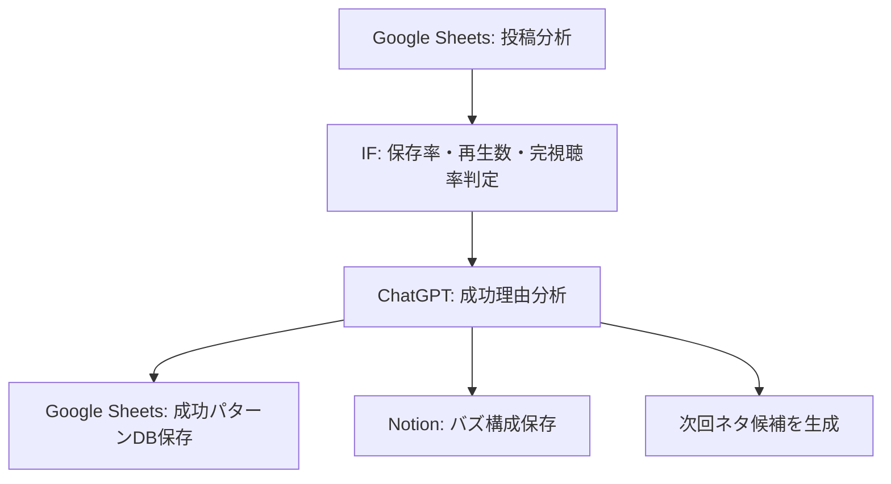

# n8nワークフロー設計

## 1. ネタ生成フロー

### 入力

テーマ

### 処理

### ChatGPT出力

- タイトル
- フック
- 台本
- 保存誘導
- コメント誘導
- サムネ案
- ハッシュタグ候補

## 2. リール制作自動化

### 半自動化するもの

- 台本生成
- 画像プロンプト生成
- 音声台本生成
- ハッシュタグ生成
- 説明文生成
- サムネ案生成

### ワークフロー

## 3. ブログ制作自動化

### 入力

撮影法名

### 出力

- ブログ下書き
- SEO
- 見出し
- 内部リンク案
- 画像挿入位置
- Google Docs保存

### ワークフロー

## 4. LINEスタンプ管理自動化

### 入力

テーマ

### 出力

- 40個文言
- 画像プロンプト
- タイトル
- 説明文
- 審査チェック

### ワークフロー

## 5. 投稿分析自動化

### 自動記録

- 再生数
- 保存数
- コメント数
- フォロー増加
- 投稿時間
- ハッシュタグ

### 注意

Instagram、TikTok、YouTubeの分析値取得は、公式APIや連携サービスの権限が必要。

最初は手入力でもよい。n8nは手入力された数値をもとに成功分析を自動化する。

## 6. 成功分析システム

### 抽出条件

- 保存率が高い
- 再生数が高い
- 完視聴率が高い

### 処理

