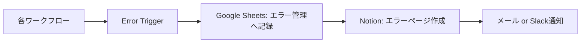

# エラー管理

## 監視するエラー

| エラー | 原因 | 対応 |
|---|---|---|
| API失敗 | AI APIの上限、接続不良 | リトライ、エラーDBへ保存 |
| 重複投稿 | 同じテーマが複数回処理 | ID重複チェック |
| 画像不足 | 画像生成未完了 | 状態を画像待ちにする |
| 保存失敗 | Drive連携エラー | 再保存、通知 |
| フォルダ不一致 | 保存先名違い | 既定フォルダへ移動 |
| JSON解析失敗 | AI出力形式崩れ | 再生成または手動確認 |

## n8nエラー処理

## エラー管理表

| 日時 | ワークフロー | エラー | 原因 | 対応 | 状態 |
|---|---|---|---|---|---|
|  |  |  |  |  | 未対応 |

## 重複防止ルール

- 投稿IDを必ず付ける
- テーマ名と投稿日で重複チェック
- 状態が「投稿済」のものは再生成しない
- 再利用する場合は「派生」として新IDを作る

