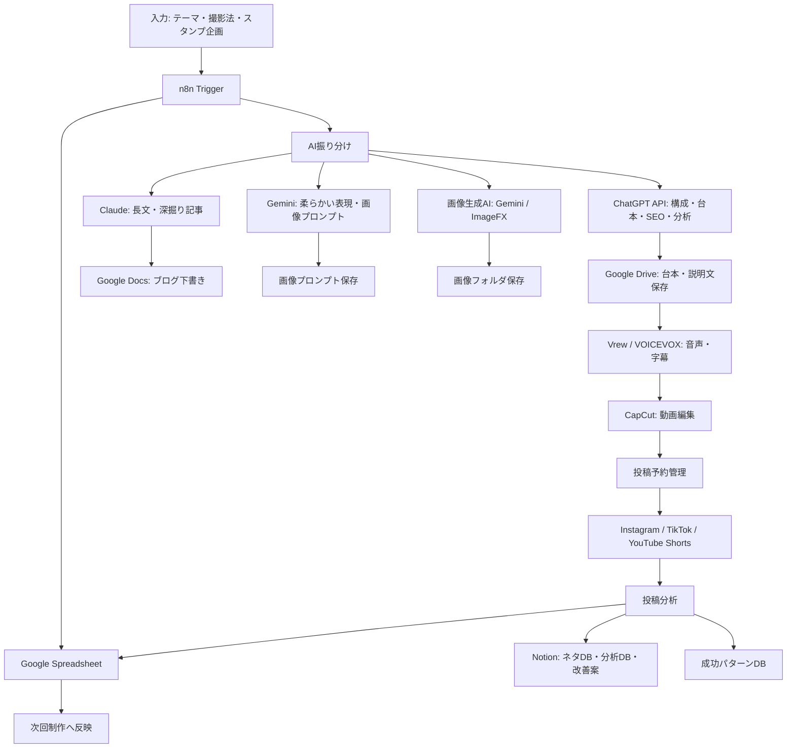

# 放射線技師の安心ラボ n8nコンテンツ制作自動化システム

## 目的

「放射線技師の安心ラボ」を、AIとn8nで半自動運営できるコンテンツ制作工場へ進化させる。

対象は、Instagramリール、TikTok、YouTube Shorts、ブログ、LINEスタンプ管理。

## 自動化すること

- リール量産
- ブログ量産
- LINEスタンプ管理
- ネタ管理
- 投稿管理
- AI自動連携
- 投稿分析
- 成功パターン抽出
- Google Drive整理
- Notion DB保存

## フォルダ構成

```text
放射線技師の安心ラボ_n8n自動化システム/
├─ 00_設計/
├─ 01_ネタ/
├─ 02_台本/
├─ 03_画像/
├─ 04_音声/
├─ 05_動画/
├─ 06_ブログ/
├─ 07_サムネ/
├─ 08_投稿予約/
├─ 09_分析/
└─ 10_バックアップ/
```

## 全体システム構成図



## 推奨運用

最初は完全自動化ではなく、半自動化で始める。

1. AIがネタ・台本・説明文・タグを作る
2. 人が医療表現と安全性を確認する
3. 画像・音声・動画は半自動で作る
4. 投稿後の分析を自動記録する
5. 伸びた型を次回へ自動反映する

