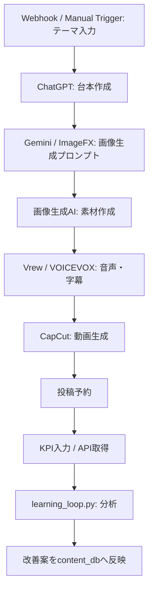

# テーマ起点コンテンツ生成フロー

## 全体フロー

```text
テーマ入力
↓
AIが台本作成
↓
画像生成
↓
動画生成
↓
投稿
↓
分析
↓
改善
```

## 各工程

| 工程 | 内容 | 保存先 |
|---|---|---|
| テーマ入力 | 投稿テーマ、ターゲット、不安、目的を入力する | `database/csv/content_db.csv` |
| AIが台本作成 | フック、本文、保存誘導、コメント誘導を生成する | `content/reels/` |
| 画像生成 | サムネ、図解、背景、画像プロンプトを作る | `content/reels/` |
| 動画生成 | 音声、テロップ、BGM、編集メモ、完成動画を作る | `content/reels/` |
| 投稿 | Instagram、TikTok、YouTube Shortsへ投稿する | `posting/` |
| 分析 | 再生数、保存率、コメント率、フォロー率を記録する | `analytics/learning-loop/` |
| 改善 | 失敗分析、勝ちパターン抽出、次回改善を行う | `analytics/reel-learning-system/` |

## n8n化する時のノード案



## 入力テンプレ

```markdown
## テーマ


## ターゲット


## 視聴者の不安・悩み


## 目的


## 投稿先

Instagram / TikTok / YouTube Shorts

## 希望尺

15秒 / 30秒 / 45秒 / 60秒
```

## 出力テンプレ

```markdown
## 台本


## 画像プロンプト


## サムネ案


## 投稿文


## ハッシュタグ


## 分析項目

- 再生数:
- 保存数:
- コメント数:
- フォロー数:
- 完視聴率:
```

