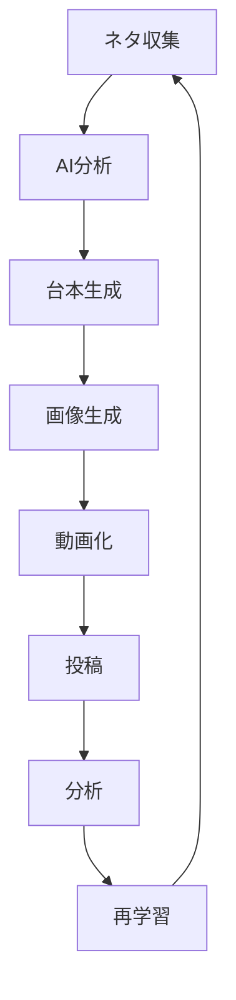

# SNS-OS 基本ワークフロー

## 全体フロー

```text
ネタ収集
↓
AI分析
↓
台本生成
↓
画像生成
↓
動画化
↓
投稿
↓
分析
↓
再学習
```

## 各工程の役割

| 工程 | 内容 | 主な保存先 |
|---|---|---|
| ネタ収集 | 投稿テーマ、検索ネタ、コメント、競合ネタを集める | `database/csv/content_db.csv` |
| AI分析 | バズ期待、保存率、危険表現、シリーズ化を評価する | `analytics/` |
| 台本生成 | フック、本文、保存誘導、コメント誘導を作る | `content/reels/` |
| 画像生成 | サムネ、図解、画像プロンプトを作る | `content/reels/` |
| 動画化 | 音声、字幕、編集、完成動画を作る | `content/reels/` |
| 投稿 | Instagram、TikTok、YouTube Shortsへ投稿・予約する | `posting/` |
| 分析 | 再生数、保存率、コメント率、フォロー率を記録する | `analytics/kpi/` |
| 再学習 | 伸びた共通点をDB化し、次回ネタへ反映する | `analytics/reel-learning-system/` |

## 運用ルール

- すべての投稿はネタ収集から始める
- 投稿前にスコアリングを行う
- 投稿後は必ずKPIを記録する
- 伸びた投稿は成功パターンDBへ移す
- 失敗した投稿も原因を記録する
- 再学習した内容を次回の台本生成に反映する

## Mermaid図



